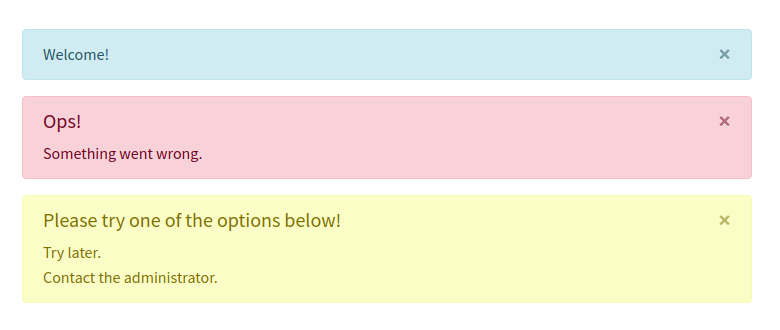

# Bootstrap 4 alerts for laravel 5.*

<p align="center">
    <a href="https://packagist.org/packages/tjgazel/laravel-bs4-alert"></a>
    <a href="https://github.com/tjgazel/laravel-bs4-alert/blob/master/LICENSE"></a>
    <a href="https://packagist.org/packages/tjgazel/laravel-bs4-alert"></a>
</p>

<p align="center"></p>

<br>

- [Instalation](#instalation)
- [Usage](#usage)
- [Tanks](#tanks)

**Other packages:**
- [tjgazel/laravel-toastr](https://github.com/tjgazel/laravel-toastr) - Toastr notifications for laravel 5.* <br>
- [tjgazel/laravel-bs3-alert](https://github.com/tjgazel/laravel-bs3-alert) - Bootstrap 3 alerts for laravel 5.*

<br>

<a name="instalation"></a>
## Installation

1. Run `composer require tjgazel/laravel-bs4-alert` to include this in your project.<br>
`Laravel 5.5 or later` will automatically discover the provider and the alias.

<br>

2. **Optional:** Laravel 5.4 and below <br>
Add `TJGazel\Bs4Alert\Bs4AlertServiceProvider::class` to `providers` in `config/app.php` <br> 
Add `'Bs4Alert' => TJGazel\Bs4Alert\Facades\Bs4Alert::class` to `aliases` in `config/app.php`. <br>
```
// config/app.php
'providers' => [
  // ...
  TJGazel\Bs4Alert\Bs4AlertServiceProvider::class,
],

'aliases' => [
  // ...
  'Bs4Alert' => TJGazel\Bs4Alert\Facades\Bs4Alert::class,
],
```

<br>

3. Run `php artisan vendor:publish --provider="TJGazel\Bs4Alert\Bs4AlertServiceProvider" --tag="config"`
to publish the config file in `config/bs4-alert.php`. <br>

4. Include `@include('bs4-alert::template')` somewhere in your template..
```
<!DOCTYPE html>
<html lang="{{ app()->getLocale() }}">
<head>
    <title></title>
    <link rel="stylesheet" type="text/css" href="/css/app.css">
</head>
<body>
    <div id="app">
        <header></header>
        
        @include('bs4-alert::template')

        <main>
            @yield('content')
        </main>

        <footer></footer>
    </app>
    <script type="text/javascript" src="js/app.js"></script>
</body>
</html>
```

<br>

5. **Optional:** Run `php artisan vendor:publish --provider="TJGazel\Bs4Alert\Bs4AlertServiceProvider" --tag="template"`
to publish the template view. <br>
Modify the published template located at `resources/views/vendor/bs4-alert/template.php` to your liking.
```
@if(session()->has(config()->get('bs4-alert.session_name')))
  @foreach(session()->get(config()->get('bs4-alert.session_name')) as $bs4Alert)
    <div class="alert {{ $bs4Alert['type'] }} alert-dismissible fade show" role="alert">
      <button type="button" class="close" data-dismiss="alert" aria-label="Close">
        <span aria-hidden="true">&times;</span>
      </button>
      @if($bs4Alert['title'])
        <h4 class="alert-heading">{!! $bs4Alert['title'] !!}</h4>
      @endif
      @foreach($bs4Alert['messages'] as $bs4AlertMessage)
        <p class="mb-0">{!! $bs4AlertMessage !!}</p>
      @endforeach
    </div>
  @endforeach
@endif
```

 <br>

6. **Optional:** Modify the publish configuration file locate at `config/bs4-alert.php` to your liking.
```
<?php

return [
 
    'session_name' => 'bs4alert',

    // Set classname for alerts
    'class' => [
        'primary'   => 'alert-primary',
        'secondary' => 'alert-secondary',
        'success'   => 'alert-success',
        'danger'    => 'alert-danger',
        'warning'   => 'alert-warning',
        'info'      => 'alert-info',
        'light'     => 'alert-light',
        'dark'      => 'alert-dark',
    ]

];
```
<br><br>

<a name="usage"></a>
## Usage

Use the Toastr facade `Bs4Alert::` or the helper function `bs4Alert()->` to access the methods in this package.
```
Bs4Alert::light(array $message, string $title = null);

bs4Alert()->dark(array $message, string $title = null);
```

<br>

**Examples:**
```
<?php

namespace App\Http\Controllers;

use Illuminate\Http\Request;
use TJGazel\Bs4Alert\Facades\Bs4Alert;

class HomeController extends Controller
{

    public function index()
    {
        Bs4Alert::info(['welcome!']);

        return view('dashoard.index');
    }
}
```

<br>

You can also chain multiple messages together using:
```
bs4Alert()
    ->danger(['Something went wrong.'], 'Ops!')
    ->warning(['Try later.', 'Contact the administrator.', ], 'Please try one of the options below!');
```
<br><br>

**All methods** <br>
```
bs4Alert()->primary();
bs4Alert()->secondary();
bs4Alert()->success();
bs4Alert()->danger();
bs4Alert()->warning();
bs4Alert()->info();
bs4Alert()->light();
bs4Alert()->dark();
```
<br>

<a name="tanks"></a>
### Tanks for:
[Bootstrap](http://getbootstrap.com/) <br>
[Laravel](https://laravel.com/)

**Author:** Talles Gazel <br>
[Home page](https://tjgweb.com.br/) <br>
[Facebook](https://www.facebook.com/talles.gazel) <br>